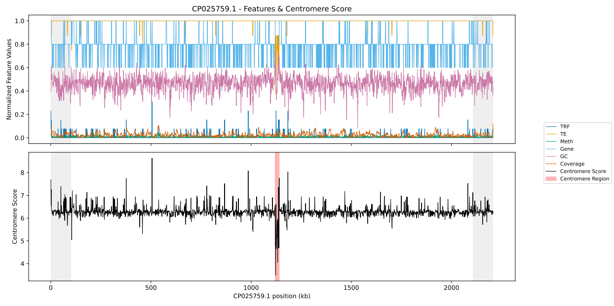

## CentroFinder Pipeline

This pipeline performs centromere detection and scoring for fungal genomes using Nanopore and PacBio sequencing data. It is implemented as a Snakemake workflow designed for execution on an HPC system with optional GPU acceleration.

The pipeline automatically selects the appropriate processing path based on the sequencing platform (Nanopore or PacBio).

## Centromere prediction example

<p align="center">
  
</p>

## Required Software

The CentroFinder pipeline relies on a combination of workflow tools, Conda-managed bioinformatics software, and a small number of externally provided components (e.g., Singularity containers and optional GPU libraries).

### Workflow and Environment Management

The following component must be available on the system **prior to setup**:

- miniconda3>=22.11.1
- singularityce>=3.11.3

All other workflow dependencies can be installed automatically using the provided Conda environment (see the **Quick Start** section):

- snakemake>=7.22.0  
- singularityce>=3.11.3  
- graphviz>=8.0.5 (optional; used for visualizing the workflow DAG)

### Core Bioinformatics Tools

All core bioinformatics dependencies are managed automatically by Snakemake using Conda and will be created during the initial execution when running with `--use-conda`.

No manual installation of the following tools is required.

- biopython>=1.81 
- trf>=4.09.1
- samtools>=1.16.1 
- cdhit>=4.8.1
- gffread>=0.12.7
- bedops>=2.4.41 
- minimap2>=2.26
- ccsmeth>=0.5.0
- pbccs>=6.3.0
- modbam2bed>=0.10.0
- matplotlib>=3.7.3

### Optional GPU-Accelerated Components

GPU acceleration is supported for methylation-related steps (ccsmeth and pbccs), but is **not required** to run the pipeline.

If GPU acceleration is desired, the following libraries must be installed and available **prior to activating Conda environments**:

- pytorch>=2.1.0
- pybedtools>=0.9.0
- scikit-learn>=1.3.2
- statsmodels>=0.14.0

If these libraries are not available, the pipeline will fall back to CPU execution. This takes much longer to complete. 

### EDTA Singularity Container

The pipeline requires the [EDTA transposable element annotation tool](https://github.com/oushujun/EDTA), which is executed via a Singularity container.

The container can be built following the [Singularity instructions](https://github.com/oushujun/EDTA#install-with-singularity-good-for-hpc-users) provided by the EDTA project, for example:

```
singularity build edta.sif docker://quay.io/biocontainers/edta:2.2.2--hdfd78af_1
```

## Setting up the file structure

The file structure for storing the original data files is as follows:
```
└── data
   └── nanopore
       └── Sample1
           ├── Sample1.fasta  
           ├── Sample1.fastq
           └── Sample1.gff3
   └── pacbio
       └── Sample3
           ├── Sample3.fasta 
           ├── Sample3.gff3
           └── Sample3.subreads.bam   
```

For example:
```
└── data
   └── nanopore
       └── cdeut
           ├── cdeut.fasta # Reference genome
           ├── cdeut.fastq # Nanopore reads (FASTQ)
           └── cdeut.gff3 # Genome annotation

# ================================
# Regarding cdeut.fastq
# ================================
# Nanopore sequencing data for Cryptococcus deuterogattii R265 were downloaded from the following source:
# https://sra-pub-src-1.s3.amazonaws.com/SRR6363418/R265_Albacore.tgz.1
# The raw Nanopore signal files were basecalled using Guppy to generate FASTQ reads. The resulting FASTQ file was placed in the following directory:
# data/nanopore/cdeut/cdeut.fastq
```

The Snakefile expects input data to be located under the `data/` directory, organized by sequencing platform (`nanopore/` or `pacbio/`), followed by a directory named after the sample.

The original data files must be set up in this manner and living in the correct `nanopore` or `pacbio` directory for the Snakefile to determine the proper set of steps to traverse for the pipeline. 

## About the config.yaml

The `config.yaml` file allows limited customization of pipeline behavior, including sample selection, performance parameters, and centromere scoring weights.

To run a sample, you will need to add it to the config file in the following manner:

```
samples:
    nanopore:
        nanopore_sample_name:
    pacbio:
        pacbio_sample_name:
```

Additional parameters that you may wish to change:
```
# ================================
# Performance parameters
# ================================

# Number of CPU cores to use per task.
# Increasing beyond ~12 cores did not improve performance on our system,
# but this may vary depending on hardware and input genome size.
cpus_per_task: 12

# ================================
# Centromere prediction parameters
# ================================

# Size (in base pairs) of the sliding window used for centromere scoring.
# Smaller windows increase resolution but may introduce noise,
# while larger windows provide smoother signals at lower resolution.
window: 1000 #default

# ================================
# Subtelomeric exclusion parameters
# ================================

# Number of base pairs excluded from each chromosome end for core chromosomes.
# Subtelomeric regions are often repeat-rich and gene-poor and can generate
# false-positive centromere predictions.
exclusion_bp_large: 100000 #default

# Number of base pairs excluded from each chromosome end for accessory
# or mini-chromosomes, which are typically much shorter.
exclusion_bp_min: 10000 #default

# ================================
# Feature weights for centromere scoring
# ================================
# The centromere score for each window is calculated as:
#   score = Σ (weight_i × feature_i)
# where feature_i is the normalized value of each feature in the window.

# Weight for tandem repeat (TRF) density.
# Centromeres are frequently enriched in tandem repeats.
trf: 8 #default

# Weight for transposable element (TE) content.
# TE-rich regions are commonly associated with fungal centromeres.
te: 5 #default

# Weight for gene absence.
# Centromeric regions are typically gene-poor.
gene: 1 #default

# Weight for CpG methylation.
# Methylation is often elevated in centromeric and pericentromeric chromatin.
meth: 1 #default

# Weight for sequencing coverage anomalies.
# Centromeres often show abnormal read depth due to repeats and mapping bias.
cov: 0.5 #default

# Weight for GC depletion.
# Many fungal centromeres are AT-rich relative to chromosome averages.
gc: 1 #default

```
The following paths must be updated to match your local environment:
```
# Singularity + EDTA
container:
  binds:
    - /work # This may be able to be removed altogether.
    - $(spack location -i ncbi-rmblastn):/rmblast # location of rmblast bound to container

edta:
  sif: edta.sif # Location of your edta.sif

# Meth Pacbio
ccsmeth:
    call_mod:
        model_file: "../models/ # Location of your model files 
        model_ccsmeth_5mCpG_call_mods_attbigru2s_b21.v3.ckpt" # Specific model file to be used.

    call_freqb:
        model_file: "../models/model_ccsmeth_5mCpG_aggregate_attbigru_b11.v2p.ckpt"
```
## Quick Start
This pipeline may be run using conda environments via the included env.yaml.

```
# Clone or download the repository
git clone https://github.com/RahnamaLab/CentroFinder.git
cd CentroFinder

# Create the base conda environment
conda env create -f env.yaml
```

## Running the Example Data
The Snakefile is looking for the specific output that you wish to create. 

We will use the files that have been used as an example throughout the documentation. 

1. Ensure that SingularityCE and Miniconda3 have been installed and the software in the env.yaml has been installed either through a conda environment or otherwise. 
2. Build the EDTA singularity image (edta.sif).
3. Modify the config.yaml as needed for your local paths and environment. 
4. Add the data. For this example, we will use the cdeut sample data, which will run through the nanopore portion of the pipeline. Those files should be placed in the CentromerDetection directory in data/nanopore/cdeut.
5. Set your config values according to the previous instructions.

You may run the entire pipeline with the following:

```
snakemake --use-conda --conda-frontend conda --cores 12 --configfile config.yaml

# Or to run all uncompleted steps on all samples:
snakemake --use-conda --conda-frontend conda --cores 12
```

Specifying the output file as the target will cause Snakemake to execute all required upstream steps automatically.

## Output files

After running the centromere prediction pipeline, results are written to a per-sample output directory using the configured window size:

`results/<sample_name>/CENTROMERE_SCORING/<sample_name>_<window_size>/`

For example:

`results/cdeut/CENTROMERE_SCORING/cdeut_1000/`

This directory contains the following structure:

```
cdeut_1000/
├── centro_best_candidates.bed
├── centro_candidates.bed
├── centro_candidates_ranked.tsv
├── centro_windows_ranked.tsv
├── centro_best_windows_marked.tsv
├── windows.features.tsv
├── centro_plots/
│   ├── scaffold_1_cen.pdf
│   ├── scaffold_2_cen.pdf
│   ├── ...
│   └── scaffold_9_cen.pdf
└── logs/

```

# Key outputs

- `centro_best_candidates.bed`
 
   Final predicted centromere coordinates.

   This file contains the best centromere interval per chromosome and represents the primary result of the pipeline.

- `centro_plots/`
 
   Per-chromosome centromere plots (*_cen.pdf) showing feature tracks and centromere scores used for prediction.

- `centro_candidates.bed`
 
   All candidate centromeric intervals prior to final selection.

- `centro_candidates_ranked.tsv`
 
   Candidate intervals ranked by composite centromere score.

- `centro_windows_ranked.tsv`
 
   Sliding windows ranked by centromere score across the genome.

- `centro_best_windows_marked.tsv`
  
   Windows contributing to the highest-scoring centromere interval for each chromosome.

- `windows.features.tsv`
  
   Per-window feature values (TRF density, TE content, methylation, GC, coverage, etc.) used in centromere scoring.

- `logs/`
  
   Log files from each pipeline step.
